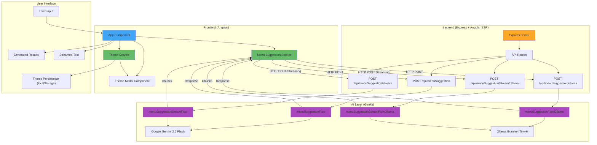

# Angular Genkit POC

A proof-of-concept application demonstrating the integration of [Angular](https://angular.dev) with [Google AI Genkit](https://firebase.google.com/docs/genkit) for AI-powered menu suggestion generation. This project showcases both traditional API calls and streaming responses using Google's Gemini AI and local Ollama models, along with a dynamic theming system.

## 🎯 Features

- **AI-Powered Menu Suggestions**: Generate creative restaurant menu items based on themes
- **Dual AI Model Support**: 
  - Google Gemini 2.5 Flash (cloud-based)
  - Ollama Granite4 Tiny-H (local model)
- **Streaming Responses**: Real-time text generation with streaming API support
- **Dynamic Theming**: Five beautiful theme options with persistent selection
- **Server-Side Rendering**: Built with Angular SSR for optimal performance
- **Type-Safe API**: Zod schema validation for robust data handling

## 🏗️ Application Architecture



## 🔄 Application Flow

1. **User Input**: User enters a restaurant theme (e.g., "Italian", "Japanese")
2. **Model Selection**: User selects between Gemini or Ollama models
3. **Generation Mode**: User chooses between standard or streaming generation
4. **API Request**: Frontend sends HTTP POST request to appropriate endpoint
5. **AI Processing**: Genkit flow processes request using selected AI model
6. **Response Handling**: 
   - Standard: Complete response returned at once
   - Streaming: Text chunks returned progressively
7. **UI Update**: Results displayed to user in real-time

## 📋 Prerequisites

### Required
- **Node.js** (v18 or higher recommended)
- **npm** or **yarn**
- **Google AI API Key**: Get your API key from [Google AI Studio](https://aistudio.google.com/app/apikey)

### Optional
- **Ollama** (for local model support): [Install Ollama](https://ollama.ai)
  - After installation, pull the Granite4 model: `ollama pull granite4:tiny-h`

## 🚀 Setup Instructions

### 1. Clone the Repository

```bash
git clone https://github.com/devhelpr/angular-genkit-poc.git
cd angular-genkit-poc
```

### 2. Install Dependencies

```bash
npm install
```

### 3. Configure Environment Variables

Create a `.env.local` file in the project root:

```bash
cp .env .env.local
```

Edit `.env.local` and add your Google AI API key:

```env
GOOGLE_GENAI_API_KEY=your_actual_api_key_here
GENKIT_ENV=dev
```

### 4. Start the Development Server

```bash
npm start
```

The application will be available at `http://localhost:4200/`

## 🎨 Available Themes

The application includes five pre-designed themes:

1. **Dark Teal** - Modern dark theme with teal accents
2. **Light Teal** - Clean light theme with teal accents
3. **Modern Orange** - Vibrant dark theme with orange accents
4. **Modern Purple** - Elegant dark theme with purple accents
5. **Modern Red** - Bold dark theme with red accents

Themes are persisted in localStorage and automatically applied on page load.

## 🔌 API Endpoints

### Non-Streaming Endpoints

#### Generate with Gemini
```http
POST /api/menuSuggestion
Content-Type: application/json

{
  "theme": "Italian"
}
```

#### Generate with Ollama
```http
POST /api/menuSuggestion/ollama
Content-Type: application/json

{
  "theme": "Japanese"
}
```

### Streaming Endpoints

#### Stream with Gemini
```http
POST /api/menuSuggestion/stream
Content-Type: application/json

{
  "theme": "Mexican"
}
```

#### Stream with Ollama
```http
POST /api/menuSuggestion/stream/ollama
Content-Type: application/json

{
  "theme": "French"
}
```

## 📁 Project Structure

```
angular-genkit/
├── src/
│   ├── app/
│   │   ├── app.ts                      # Main app component
│   │   ├── menu-suggestion.service.ts  # Menu suggestion API service
│   │   ├── theme.service.ts            # Theme management service
│   │   └── theme-modal.component.ts    # Theme selector modal
│   ├── genkit/
│   │   └── menuSuggestionFlow.ts       # Genkit AI flows
│   ├── config/
│   │   └── environment.ts              # Environment configuration
│   ├── styles/
│   │   └── themes/                     # SCSS theme files
│   └── server.ts                       # Express server with API routes
├── package.json
└── README.md
```

## 🛠️ Development

### Code Scaffolding

Generate a new component:
```bash
ng generate component component-name
```

View all available schematics:
```bash
ng generate --help
```

### Building for Production

```bash
ng build
```

Build artifacts will be stored in the `dist/` directory.

### Running Tests

```bash
ng test
```

## 🔧 Technologies Used

- **Frontend**: Angular 20.3.0 with SSR
- **AI Framework**: Google AI Genkit 1.21.0
- **AI Models**: 
  - Google Gemini 2.5 Flash
  - Ollama Granite4 Tiny-H
- **Backend**: Express.js
- **Styling**: SCSS with custom theming
- **Validation**: Zod schemas
- **Type Safety**: TypeScript 5.9

## 🤝 Contributing

Contributions are welcome! Please feel free to submit a Pull Request.

## 📄 License

This project is provided as-is for educational and demonstration purposes.

## 🔗 Additional Resources

- [Angular Documentation](https://angular.dev)
- [Google AI Genkit Documentation](https://firebase.google.com/docs/genkit)
- [Ollama Documentation](https://ollama.ai)
- [Google AI Studio](https://aistudio.google.com/app/apikey)
